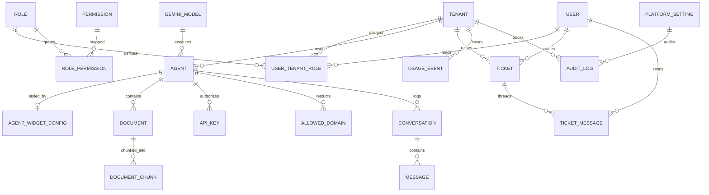

# Brain Plug — System Architecture & Technical Design

This document details the architectural topology, data flows, security boundaries, database entity relationships, and core subsystem implementations of the Brain Plug Multi-Tenant AI Agent Platform.

---

## 1. System Topology Overview

```
+---------------------------------------------------------------------------------------------------------+
|                                              CLIENT TIER                                                |
|   [ Standalone Widget (widget.js) ]    [ Admin Dashboard (/admin) ]    [ Client Workspace (/client) ]  |
+---------------------------------------------------------------------------------------------------------+
                                                     │ HTTPS / WSS
                                                     ▼
+---------------------------------------------------------------------------------------------------------+
|                                            API GATEWAY & ROUTING                                        |
|                          Next.js 16 App Router • Route Handlers • Edge Middleware                      |
|                                                                                                         |
|   [ Rate Limiter (Token Bucket) ]   [ CORS & Domain Guard ]   [ Authentication & RBAC Engine ]          |
+---------------------------------------------------------------------------------------------------------+
                                                     │
               ┌─────────────────────────────────────┼─────────────────────────────────────┐
               ▼                                     ▼                                     ▼
+-----------------------------+     +-----------------------------+     +-----------------------------+
|      AI & RAG ENGINE        |     |     CR & SUPPORT NOTIFIER   |     |     SECURITY & STORAGE      |
|  - Gemini 1.5/2.0 Streaming |     |  - Support Ticket Service   |     |  - AES-256-GCM Cryptography |
|  - Embedding Generator      |     |  - Nodemailer SMTP Mailer   |     |  - Cloudinary File Storage  |
|  - Cosine Similarity Rerank |     |  - OTP Dual-Mode Dispatcher |     |  - Audit Log Collector      |
+-----------------------------+     +-----------------------------+     +-----------------------------+
               │                                     │                                     │
               └─────────────────────────────────────┼─────────────────────────────────────┘
                                                     ▼
+---------------------------------------------------------------------------------------------------------+
|                                            DATA PERSISTENCE                                             |
|                                       PostgreSQL 16 + Prisma ORM                                        |
|  [ Tenants ]   [ Users & Roles ]   [ Agents & Widgets ]   [ Document Chunks (Vectors) ]   [ Tickets ]   |
+---------------------------------------------------------------------------------------------------------+
```

---

## 2. Multi-Tenancy & Data Isolation Model

Brain Plug enforces **Logical Database Multi-Tenancy with Tenant ID Discriminators**:

1. **Foreign Key Enforcement**: All tenant-scoped entities (`Agent`, `Document`, `DocumentChunk`, `ApiKey`, `AllowedDomain`, `Conversation`, `Ticket`, `UsageEvent`, `AuditLog`) maintain a mandatory foreign key `tenantId -> Tenant.id`.
2. **Context Resolution**: Incoming requests are validated through `requireTenantAccess()` in `server/auth/context.ts`, ensuring that a client user can only query and mutate records belonging to their assigned tenant organization.
3. **Super Admin Bypass**: Only users holding the system role `SUPER_ADMIN` are permitted to inspect cross-tenant records, view aggregated platform analytics, or manage global Gemini models.

```
                    ┌─────────────────────────────────────────────────────────┐
                    │               PostgreSQL Database (brain_plug)          │
                    ├────────────────────────────┬────────────────────────────┤
                    │   Tenant Organization A    │   Tenant Organization B    │
                    ├────────────────────────────┼────────────────────────────┤
                    │ • Agent: "Acme Support"    │ • Agent: "Beta Assistant"  │
                    │ • Chunks: [Doc 1, Doc 2]   │ • Chunks: [Doc 3, Doc 4]   │
                    │ • API Keys: bp_live_acme.. │ • API Keys: bp_live_beta.. │
                    │ • Tickets: #101, #102      │ • Tickets: #103, #104      │
                    │ • Roles: CLIENT_ADMIN (A)  │ • Roles: CLIENT_ADMIN (B)  │
                    └────────────────────────────┴────────────────────────────┘
```

---

## 3. End-to-End Data Flows

### A. Open Self-Service Registration & Passwordless OTP Auth
```
[ User visits /login?tab=register ]
                │
                ▼
[ POST /api/v1/auth/register (fullName, companyName, email) ]
                │
                ▼
[ AuthService.registerClient() in $transaction ]
    ├── 1. Creates Tenant (status: ACTIVE, slug: company-xyz)
    ├── 2. Creates User (email: user@company.com)
    ├── 3. Assigns CLIENT_ADMIN UserTenantRole
    ├── 4. Creates Starter Agent ("Company AI Assistant") & Widget Config
    └── 5. Generates 6-digit OTP, stores SHA-256 hash, dispatches via Nodemailer
                │
                ▼
[ POST /api/v1/auth/verify-otp (email, otp) ]
                │
                ▼
[ Issues 3-hour JWT Cookie (bp_session) -> Auto-redirects to /client/dashboard ]
```

### B. Document Ingestion & Vector RAG Pipeline
```
[ Upload Document (PDF, DOCX, TXT, XLSX) via /client/agents/[id]/knowledge ]
                │
                ▼
[ DocumentParserService: Multiformat Text Extraction ]
                │
                ▼
[ Chunking Engine: 500-token chunks with 50-token overlap ]
                │
                ▼
[ GeminiService: text-embedding-004 768-dimensional vector generation ]
                │
                ▼
[ PostgreSQL: Stored in document_chunks table with tenantId & agentId ]
```

### C. Real-Time Streaming Inference & Shadow DOM Widget
```
[ Website Visitor types question in Chat Widget ]
                │
                ▼
[ POST /api/v1/chat (stream: true, agentId, message) ]
                │
                ▼
[ CORS & Allowed Domain Validation (checks allowed_domains table) ]
                │
                ▼
[ Vector Search: Cosine Similarity between Query Vector and Tenant Document Chunks ]
                │
                ▼
[ Grounding Context: Injects Top-5 Chunks (>0.40 score) into Gemini System Prompt ]
                │
                ▼
[ Gemini 2.0 Flash: Streams tokens via Server-Sent Events (SSE) (TTFT < 450ms) ]
                │
                ▼
[ Widget Shadow DOM renders markdown tokens + citation source badges in real-time ]
```

### D. Customer Relations (CR) & Support Ticketing Flow
```
[ Client User: /client/tickets ] ──(POST /api/v1/tickets)──> [ Database: Ticket Created ]
                                                                      │
                                                     ┌────────────────┴────────────────┐
                                                     ▼                                 ▼
                                      [ Email: Alert to Admin ]          [ Email: Receipt to Client ]
                                                     │                                 │
                                                     └────────────────┬────────────────┘
                                                                      ▼
                                                       [ Super Admin: /admin/tickets ]
                                                                      │
                                                 (PATCH Status / POST Reply / Internal Note)
                                                                      │
                                                                      ▼
                                                       [ Email: Update to Client ]
```

---

## 4. Input / Output Schemas & Data Contracts

All API boundaries are strictly validated at runtime using **Zod schemas**:

### Authentication Contracts (`schemas/auth.schema.ts`)
```typescript
export const registerClientSchema = z.object({
  fullName: z.string().min(2, "Full name must be at least 2 characters"),
  companyName: z.string().min(2, "Workspace / Company name must be at least 2 characters"),
  email: z.string().email("Please provide a valid email address"),
  mobile: z.string().optional().nullable(),
  location: z.string().optional().nullable(),
});

export const verifyOtpSchema = z.object({
  email: z.string().email("Please provide a valid email address"),
  otp: z.string().length(6, "OTP must be exactly 6 digits"),
  purpose: z.enum(["LOGIN", "EMAIL_VERIFICATION", "ONBOARDING"]).default("LOGIN"),
});
```

### Chat Inference Contracts (`schemas/chat.schema.ts`)
```typescript
export const chatRequestSchema = z.object({
  agentId: z.string().uuid("Valid agent ID required"),
  message: z.string().min(1, "Message cannot be empty").max(4000, "Message exceeds 4000 chars"),
  conversationId: z.string().uuid().optional(),
  stream: z.boolean().default(true),
});
```

---

## 5. Technology Stack & Trade-Off Rationale

| Technology Layer | Selected Tool | Alternative Considered | Trade-Off Rationale |
|---|---|---|---|
| **Core Framework** | Next.js 16 App Router | Express + React SPA | Atomic end-to-end TypeScript safety, zero CORS friction, unified deployment bundle, and Turbopack compiler speed. |
| **Database & ORM** | PostgreSQL 16 + Prisma ORM | MongoDB / DynamoDB | Strict relational integrity, foreign key cascading, ACID transactions for multi-tenant billing, and native vector math. |
| **Vector Search** | PostgreSQL Vector Math / pgvector | Pinecone / Milvus SaaS | Zero external vendor lock-in, zero additional SaaS hosting costs, instant local reproducibility, and atomic transactional rollbacks. |
| **Inference Models** | Google Gemini 2.0 Flash & 1.5 Pro | OpenAI GPT-4o / Claude 3.5 | Sub-400ms time-to-first-token, native 1M+ context window, database-injected API keys, and cost-effective embedding rates ($0.00002/1k tokens). |
| **Frontend Styling** | Tailwind CSS + Glassmorphism | Material UI / Chakra | Full design token control, lightweight bundle footprint, and isolation from widget host styles. |
| **Transactional Mail** | Nodemailer SMTP Transporter | SendGrid SDK / Mailgun SDK | Provider agnostic; supports any standard corporate SMTP relay, Amazon SES, or custom mail server with zero SDK bloat. |

---

## 6. Database Entity Relationship Model (ERD)



---

## 7. Security & Cryptographic Architecture

1. **AES-256-GCM Cryptography**:
   - Passwords, sensitive integration secrets, and API credentials are encrypted with authenticated symmetric AES-256-GCM using a 32-byte secret key, randomized 16-byte initialization vectors (IV), and 16-byte authentication tags.
2. **Timing-Safe Hash Comparison**:
   - Verification of OTPs and tokens uses `crypto.timingSafeEqual()` to prevent side-channel timing attacks.
3. **Shadow DOM Widget Isolation**:
   - The embeddable widget (`widget.js`) renders inside an isolated Shadow DOM container with `mode: 'closed'`, completely insulating it from host webpage CSS rules and preventing style collisions.
4. **Token-Bucket Rate Limiting**:
   - In-memory sliding-window token bucket enforces per-IP and per-tenant rate limits across authentication and chat streaming routes.
